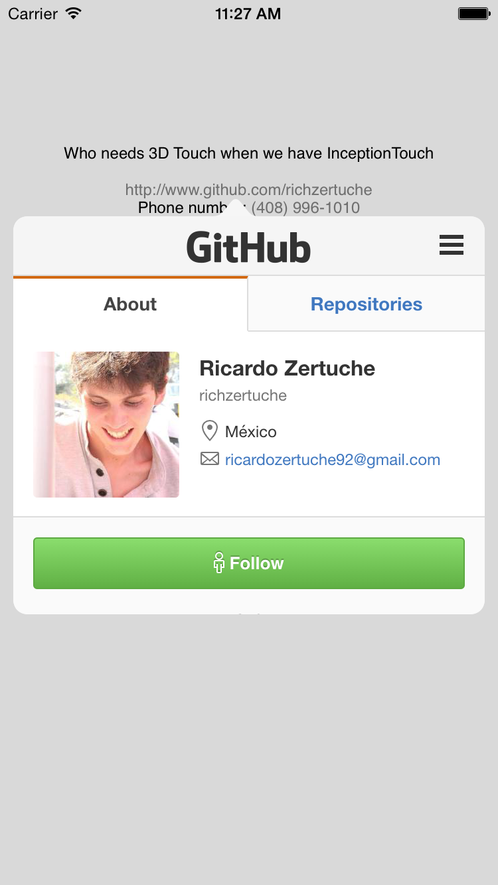

# InceptionTouch

<h6>Swift / 3DTouch for Every Device</h6>



**Create your InceptionTouch TextView**

<h6>Swift</h6>
```swift
var it_be: InceptionTouch?

it_be = InceptionTouch(frame: CGRectMake(0, 100, self.view.frame.size.width, 300))
it_be!.inceptionTouchDelegate = self
it_be!.textAlignment = .Center
it_be!.text = "Who needs 3D Touch when we have InceptionTouch \n\nhttp://www.github.com/richzertuche \nPhone number: (408) 996-1010 \n1 November 2015! \n1 Infinite Loop Cupertino, CA 95014"
        self.view .addSubview(it_be!)
```
<br>

**Add the delegate function**
<br>Type 0 - Date
<br>Type 1 - Phone Numer
<br>Type 2 - URL
<br>Type 3 - Optional[Address]
<br>

<h6>Swift</h6>
```swift
func typeOfLink(type: Int, link: String) {
   
   println("\(type) - \(link)")
        
   if type == 2{
       self.showPreview(it_be!, link: link)
   } else {
       let alert = UIAlertView(title: "A dream inside a dream", message: "Handle me! I am \(link)", delegate: self, cancelButtonTitle: "OK")
       alert.show()
   }
        
}
```

**The popover was added at the bottom, custom made to show the webview, but you can do whatever you like with the type returned by the delegate.**

Hope you find it useful.
<br>
<p>Follow me on Twitter <a href="https://www.twitter.com/richzertuche" target="_blank"> @richzertuche</a></p>
